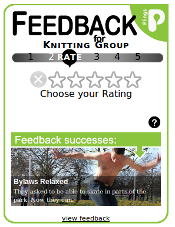

****************
Widgets Overview
****************

FastFeedback
============

Fastfeedback is a box-style widget designed to be included in a page which holds
details about a pling.

The widget is suited to inclusion in sidebars or column layout pages. The widget
requires a minimum space of 280px by 265px.

Fastfeedback is designed to suport multiple uses on the same page to gather 
feedback about different plings. The widget prominently displays the title of
the relevant pling.

Fastfeedback can be presented in a variety of colour themes (currently green and
orange).

The widget uses a sequence of slides to ask its users to provide any/all of the 
following:

* Whether or not they attended the activity
* A rating for the activity (on a 5 star scale)
* A comment about the activity
* A 'signature' for their feedback, which might be:
    - A mobile phone number
    - An email address
    - A Facebook account
    - Anonymous
    
Users can supply any of the above data, which is saved in sections, at the end 
of each individual interaction.

Fastfeedback also displays a slideshow of inspirational stories intended to 
highlight the effectiveness of giving feedback.
    
TopBar
======

TopBar is a bar-style widget designed to be displayed across the top of a page
which contains details of a pling. The occupies a space 65px high and the full
width of the browser window.

.. image:: _static/_images/topbar.png

TopBar presents a single interface which asks its users to provide any/all of
the following.

* Whether or not they attended the activity
* A rating for the activity (on a 5 star scale)
* A comment about the activity
* A 'signature' for their feedback, which might be:
    - A mobile phone number
    - An email address
    - A Facebook account
    - Anonymous
    
As soon as any valid data has been entered the widget exposes its 'send' button.

Stars
=====

A simple rating widget. Once a rating (in five star format) has been entered the 
display changes to reveal the average rating for the activity.

Plingback Button
================

An alternative presentation of FastFeedback, Plingback Button assists in deploying
buttons which activate Fastfeedback in a modal site overlay. See :ref:`modal-widgets-label`

Groupback
=========

A version of the Fastfeedback widget has been used in an app designed to help 
gather feedback at an activity by passing a mobile device around participants.
See :ref:`groupback-label`

.. _greasemonkey-scripts-label:

Greasemonkey Demo
=================

If you'd like to see the widgets in action (or need a starting point for 
developing a script which will let you see the widgets on your own site for 
testing purposes) there are three **Greasemonkey** user scripts available which
insert the widgets into activity pages on http://plings.net. Use the following
steps to enable the scripts in your copy of Firefox:

    * Get Firefox_ if you haven't already...
    * Install the Greasemonkey_ extension
    * Load the user script to enable the Fastfeedback widget http://plingback.appspot.com/widgets/testing/fastfeedback.user.js
    * Load the user script to enable the Topbar widget http://plingback.appspot.com/widgets/testing/plingback.user.js
    * Load the user script to enable the Plingback Button widget http://plingback.appspot.com/widgets/testing/plingback_button.user.js
    * Visit a plings activity page such as http://plings.net/a/575002
    * Disable a couple of the scripts when it all gets a bit overwhelming
    
.. _Firefox: http://getfirefox.com
.. _Greasemonkey: https://addons.mozilla.org/en-US/firefox/addon/748/

