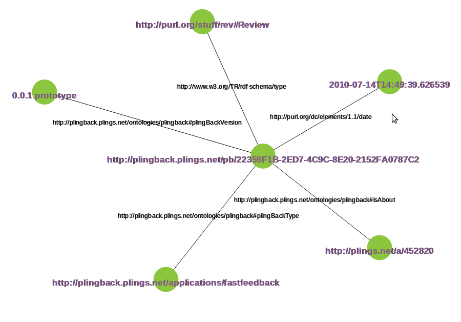
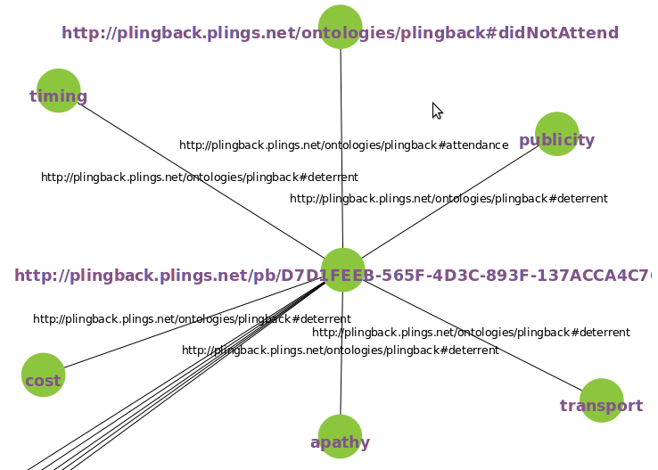
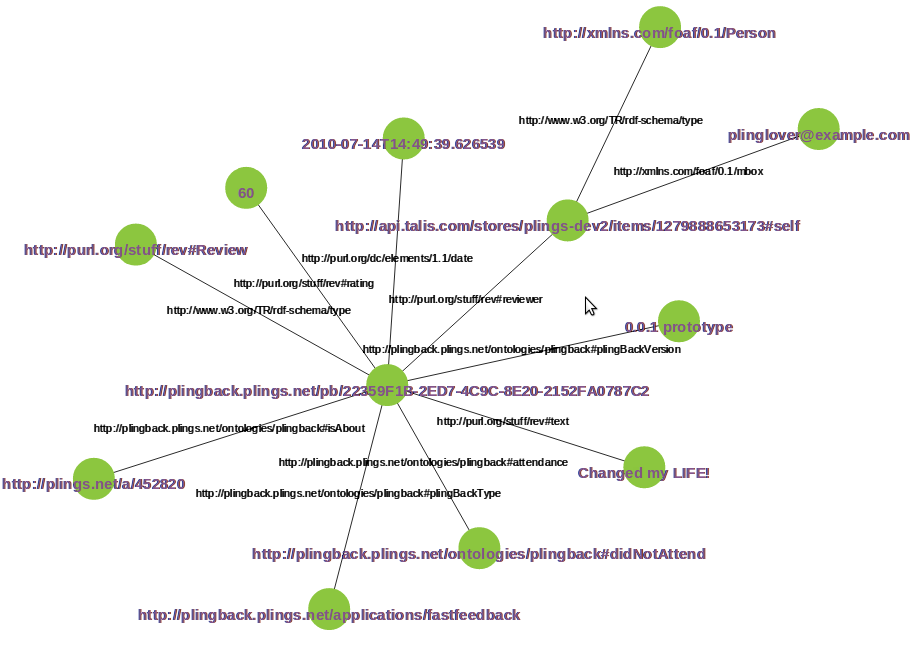
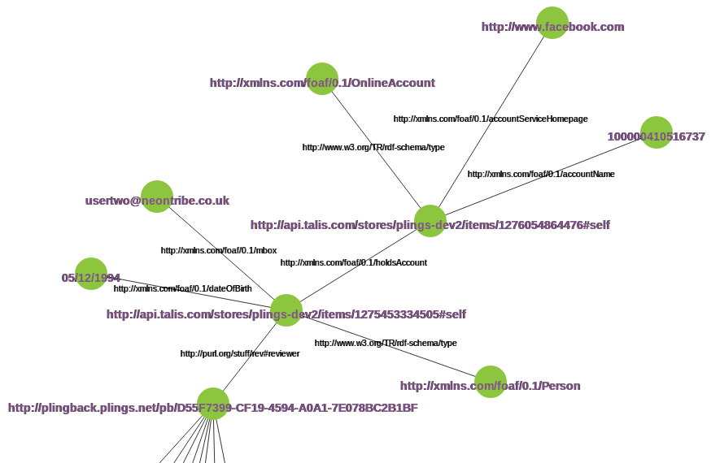

***************
Data Structures
***************

Overview
********

The Plingback API uses the Talis_ Platform to persist feedback data. This section
describes the data model for the feedback node and its various attributes.

In order to assist other systems in making use of the feedback data efforts have
been made to reuse existing ontologies as far as possible. Where existing
ontologies haven't been found to describe the data new ones have been 
invented. These new ontologies are subject to change.

Currently the custom ontology has the namespace::

    http://plingback.plings.net/ontologies/plingback#

.. _Talis : http://www.talis.com/platform/

Modelling
*********

Modelling the Feedback Node
---------------------------

Each time that feedback is submitted to the system a feedback node is created.
The node is a URI formed in the namespace::

        http://plingback.plings.net/pb/
    
Each node has a unique identifier in the namespace (for more details see 
:ref:`feedback-identifiers-label`) yielding URIs of the form::

        http://plingback.plings.net/pb/BD402341-1ED3-4EEE-A2C0-DCF87658A01B
        
We initialize the node by writing a sequence of triples, each has the URI as its
subject, our intentions are to:

    * Identify the plings activity which this feedback describes
    * Record a timestamp for the feedback submission
    * Indicate that this URI can be treated as a 'Review' conforming to a widely used vocabulary
    * Record which client application was used to submit the feedback
    * *(optionally)* Record the version of the client application

Identifying the Pling
.....................

No existing predicate could be found for declaring that a URI provides 
supplementary information about an activity recorded in the plings database.
Whilst some general purpose vocabularies provide the means to to this 
*in a general sense* it was felt that they were liable to misinterpretation.

Accordingly a predicate `isAbout` has been added to the http://plingback.plings.net/ontologies/plingback#
ontology. The object of an `isAbout` triple should be a URI such as::

    http://plings.net/a/456740
    
Which uniquely identifies an activity.

Recording a Timestamp
.....................

We make use of the `date` element from the vocabulary of Dublin Core metadata to
record a timestamp::

    http://purl.org/dc/elements/1.1/date
    
The value which is stores is a string serialization of a UTC date time object 
such as that returned by python's `datetime.now()`

Marking the Node as a Review
............................

The `RDF Review Vocabulary` provides a convenient, widely-used and expressive means
to model reviews and ratings. Plingbacks uses it extensively. It is to be found at::

    http://purl.org/stuff/rev#
    
In order to mark our feedback node as a `Review` under this vocabulary we use::

    http://www.w3.org/TR/rdf-schema/type
    
Recording Client Application Details
....................................

We use two predicates from the `plingback` ontology to record the name and version
of the software which the respondant used to give their feedback:

    * `plingBackType`
    * `plingBackVersion`
    
Currently the objects of these predicates are expected to be string values.

A Fully Initialised Feedback Node
.................................

It's convenient at this point to visualise a node which has been created according
to this scheme: :ref:`vis-base-feedback`

:ref:`vis-attendance`

:ref:`vis-deterrent`

:ref:`vis-rating`

:ref:`vis-comment`

:ref:`vis-reviewer`

:ref:`vis-reviewer-facebook`

Examples
********

Graph Visualisations
--------------------

.. _vis-base-feedback:

Base Feedback Node (visualisation)
..................................

 
.. _vis-attendance:
 
Feedback Node with Attendance (visualisation)
.............................................
 
.. image:: _static/_images/fastfeedback_node_attendance.png

.. _vis-deterrent:
 
Feedback Node with Deterrents (visualisation)
.............................................
 

 
.. _vis-rating:
 
Feedback Node with Rating (visualisation)
.........................................
 
 .. image:: _static/_images/fastfeedback_node_rating.png

.. _vis-comment:
 
Feedback Node with Comment (visualisation)
..........................................
 
 .. image:: _static/_images/fastfeedback_node_comment.png
   
.. _vis-reviewer:
 
Feedback Node with Reviewer (visualisation)
...........................................

.. _vis-reviewer-facebook:
 
Feedback Node with Reviewer Facebook Details (visualisation)
............................................................

SPARQL Examples
---------------

Namespaces
..........

Queries
.......

Live Examples
-------------